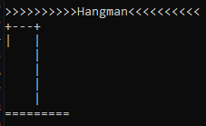

<h1 align="center"> Jogo da Forca - Hangman </h1>

  

📌 <strong>Sobre o jogo</strong>

O jogo da forca é um jogo em que o jogador tem que acertar qual é a palavra correta, tendo como dica o número de letras representados por traços no board. A cada letra errada, é desenhado uma parte do corpo do enforcado. Sendo assim, o jogador tem 6 tentativas para vencer o jogo, caso contrário será inforcado e perderá.

Este projeto foi proposto pela Data Science Academy no curso de Python Fundamentos para Análise de Dados no Capítulo 5, utilizando todo o conteúdo passado até o momento, como listas, classes, métodos, objetos, atributos, condicionais, laços de repetição, tipos de variáveis e funções Bult-in.

🚀 <strong>Tecnologias utilizadas </strong>

- [Python](https://www.python.org/)
- [VSCode](https://code.visualstudio.com/)

:gear: <strong>Como executar</strong>

- Pode ser feito o download da pasta ZIP que contém o arquivo.

- Além da possibilidade de clonar o repositório a partir do programa Git instalado na máquina.

- O jogo pode ser executado a partir de uma IDE instalada, como o VSCode proposto acima que possibilita testes e análise do código.

- No próprio Prompt de Comando do sistema operacional, em que roda apenas o programa sem ver o código. 
